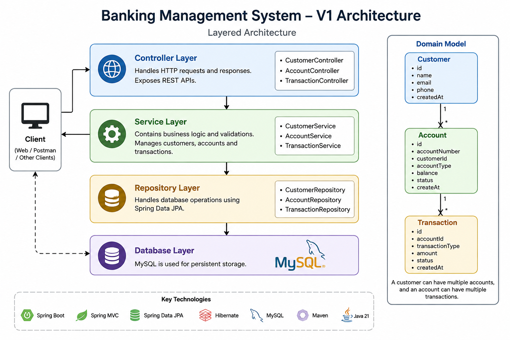

# Banking Management System

A backend banking management system built using **Java 21** and **Spring Boot**.  
The project implements core banking operations such as customer management, account management, deposits, withdrawals, transaction history, validation, exception handling, and automated API testing.

---

## Version 1

Version 1 focuses on building the core banking functionality with a layered Spring Boot architecture.

### V1 Includes

- Customer management
- Account management
- Deposit transactions
- Withdrawal transactions
- Transaction history
- Request validation
- Global exception handling
- MySQL database persistence
- Automated API integration testing

---

## Features

### Customer Management

- Create a customer
- Retrieve all customers
- Prevent duplicate customer email addresses
- Validate customer input

### Account Management

- Create a bank account
- Retrieve an account by account number
- Retrieve all accounts
- Associate an account with a customer
- Support account status management
- Maintain account balance

### Transaction Management

- Deposit money
- Withdraw money
- Maintain transaction records
- Check account balance before withdrawal
- Prevent withdrawal when balance is insufficient
- Retrieve transaction history for an account

### Validation

Request validation is implemented using Jakarta Bean Validation.

Examples include:

- Required fields
- Valid email format
- Positive transaction amounts
- Valid account information

### Exception Handling

The application uses a global exception handler with `@RestControllerAdvice`.

Handled cases include:

- Customer already exists
- Customer not found
- Account not found
- Insufficient balance
- Validation errors

Example error response:

```json
{
  "status": 404,
  "message": "Account Not Found",
  "timestamp": "2026-08-26T12:00:00"
}
```

---

# Tech Stack

| Technology | Purpose |
|---|---|
| Java 21 | Programming language |
| Spring Boot | Backend framework |
| Spring MVC | REST API development |
| Spring Data JPA | Database access |
| Hibernate | ORM |
| MySQL | Relational database |
| Maven | Build and dependency management |
| JUnit | Automated testing |
| MockMvc | API integration testing |
| IntelliJ IDEA / VS Code | Development environment |
| Postman | API testing |

---

# Architecture

The application follows a layered architecture:

```text
                    Client
                   (Postman)
                       |
                       v
              +----------------+
              |  Controllers   |
              +--------+-------+
                       |
                       v
              +----------------+
              |    Services    |
              +--------+-------+
                       |
                       v
              +----------------+
              |  Repositories  |
              +--------+-------+
                       |
                       v
              +----------------+
              |     MySQL      |
              +----------------+
```

## Layers

### Controller Layer

Responsible for:

- Receiving HTTP requests
- Request validation
- Returning HTTP responses

Main controllers:

- `CustomerController`
- `AccountController`
- `TransactionController`

### Service Layer

Contains the application's business logic.

Main services:

- `CustomerService`
- `AccountService`
- `TransactionService`

### Repository Layer

Handles database operations using Spring Data JPA.

Main repositories:

- `CustomerRepository`
- `AccountRepository`
- `TransactionRepository`

### Database Layer

MySQL is used for persistent data storage.

---
## Architecture

The application follows a layered Spring Boot architecture:



The architecture consists of:

- **Controller Layer** — Handles HTTP requests and responses
- **Service Layer** — Contains business logic
- **Repository Layer** — Handles database operations
- **Database Layer** — MySQL persistence

# Domain Model

The main relationship between the entities is:

```text
Customer
    |
    | 1 : N
    v
Account
    |
    | 1 : N
    v
Transaction
```

A customer can have multiple accounts.

An account can have multiple transactions.

---

# API Documentation

Complete API documentation is available in:

[API Documentation](./docs/API.md)

The API documentation contains:

- HTTP method
- Endpoint
- Request body
- Response body
- HTTP status codes
- Error responses
- Example requests

---

# Database Configuration

The application uses **MySQL**.

## Requirements

Make sure MySQL is installed and running.

Default local configuration:

```text
Host: localhost
Port: 3306
Database: banking_system
Username: root
```

## Create the Database

Open MySQL Workbench or MySQL Command Line Client and run:

```sql
CREATE DATABASE banking_system;
```

Verify the database:

```sql
SHOW DATABASES;
```

You should see:

```text
banking_system
```

---

# Application Configuration

After cloning the repository, open:

```text
src/main/resources/application.properties
```

Configure your local MySQL connection:

```properties
spring.datasource.url=jdbc:mysql://localhost:3306/banking_system
spring.datasource.username=root
spring.datasource.password=YOUR_MYSQL_PASSWORD

spring.jpa.hibernate.ddl-auto=update
spring.jpa.show-sql=true
```

Replace:

```text
YOUR_MYSQL_PASSWORD
```

with your local MySQL password.

> **Important:** Do not commit your real MySQL password to GitHub.

For production environments, database credentials should be provided using environment variables or a secure configuration mechanism.

---

# Running the Application

## Requirements

Install the following:

- Java 21
- MySQL
- Git
- IntelliJ IDEA or VS Code

Maven does not need to be installed separately because this project includes the Maven Wrapper.

---

## 1. Clone the Repository

Clone the repository:

```bash
git clone <your-github-repository-url>
```

Move into the project directory:

```bash
cd banking-management-system
```

The project root should contain:

```text
banking-management-system/
├── .mvn/
├── src/
├── .gitignore
├── mvnw
├── mvnw.cmd
├── pom.xml
└── README.md
```

---

## 2. Configure MySQL

Make sure MySQL is running.

Create the database:

```sql
CREATE DATABASE banking_system;
```

Then configure your MySQL credentials in:

```text
src/main/resources/application.properties
```

---

## 3. Run Using IntelliJ IDEA

1. Open IntelliJ IDEA.
2. Select **File → Open**.
3. Select the cloned `banking-management-system` folder.
4. IntelliJ should detect `pom.xml` as a Maven project.
5. Wait for Maven dependencies to finish downloading.
6. Open the main Spring Boot application class.
7. Click the green **Run** button.

The application will start at:

```text
http://localhost:8080
```

---

## 4. Run Using VS Code

1. Open VS Code.
2. Select **File → Open Folder**.
3. Select the cloned `banking-management-system` folder.
4. Install the Java and Spring Boot extensions if required.
5. Wait for Maven dependencies to load.
6. Open the main Spring Boot application class.
7. Click **Run** above the `main()` method.

The application will start at:

```text
http://localhost:8080
```

---

## 5. Run Using Maven Wrapper

### Windows

```powershell
.\mvnw.cmd spring-boot:run
```

### Linux / macOS

```bash
./mvnw spring-boot:run
```

After successful startup:

```text
http://localhost:8080
```

---

# Testing

Version 1 includes automated API integration tests using:

- JUnit
- Spring Boot Test
- MockMvc

The tests verify actual HTTP API behavior.

## Customer API Tests

- Successful customer creation
- Duplicate email
- Invalid customer request

## Account API Tests

- Successful account creation
- Customer not found
- Invalid account request

## Transaction API Tests

- Successful deposit
- Successful withdrawal
- Insufficient balance
- Negative deposit amount
- Deposit with non-existing account
- Withdrawal with non-existing account

All V1 API tests are passing successfully.

---

# Running Tests

## IntelliJ IDEA

1. Open:

```text
src/test/java
```

2. Right-click the test package or test class.
3. Select **Run Tests**.

## VS Code

Open the test class and click **Run Test** above the test method.

## Windows

```powershell
.\mvnw.cmd test
```

## Linux / macOS

```bash
./mvnw test
```

---

# Using the API

Once the application is running, the APIs can be tested using Postman.

Base URL:

```text
http://localhost:8080
```

Example:

```http
POST http://localhost:8080/api/customers
```

For complete endpoint information, request examples, response examples, and status codes:

[API Documentation](docs/API.md)

---

# Project Structure

```text
banking-management-system/
│
├── .mvn/
│
├── src/
│   ├── main/
│   │   ├── java/
│   │   │   └── com/prem/banking_management_system/
│   │   │       ├── accounts/
│   │   │       ├── customers/
│   │   │       ├── dtos/
│   │   │       └── exceptions/
│   │   │
│   │   └── resources/
│   │       └── application.properties
│   │
│   └── test/
│       └── java/
│
├── docs/
│   ├── API.md
│   └── architecture/
│       └── v1-architecture.png
│
├── .gitignore
├── mvnw
├── mvnw.cmd
├── pom.xml
└── README.md
```

---

# Version 1 Status

**Version 1 is complete.**

V1 provides the core banking functionality with:

- REST APIs
- MySQL persistence
- Business validation
- Global exception handling
- Automated API integration tests

---

# Future Improvements

Version 2 will focus on production-oriented backend concepts, including:

- Concurrent transactions
- Race-condition prevention
- Optimistic locking
- Pessimistic locking
- Transaction safety
- Idempotency
- Concurrent API testing
- Improved transaction processing


---
## Author

**Prem Kumar**  
Backend Developer | Java | Spring Boot

[Portfolio](https://portfolio-prem3405.vercel.app/) •
[LeetCode](https://leetcode.com/u/prem_cse_03/) •
[LinkedIn](https://www.linkedin.com/in/premkumarrajamani/)